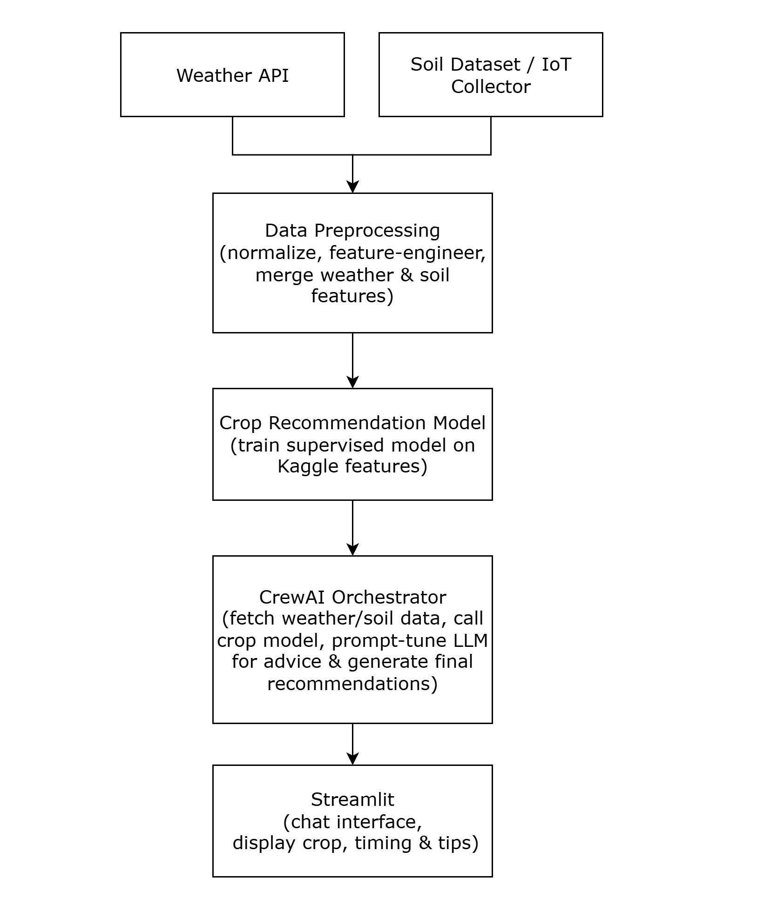
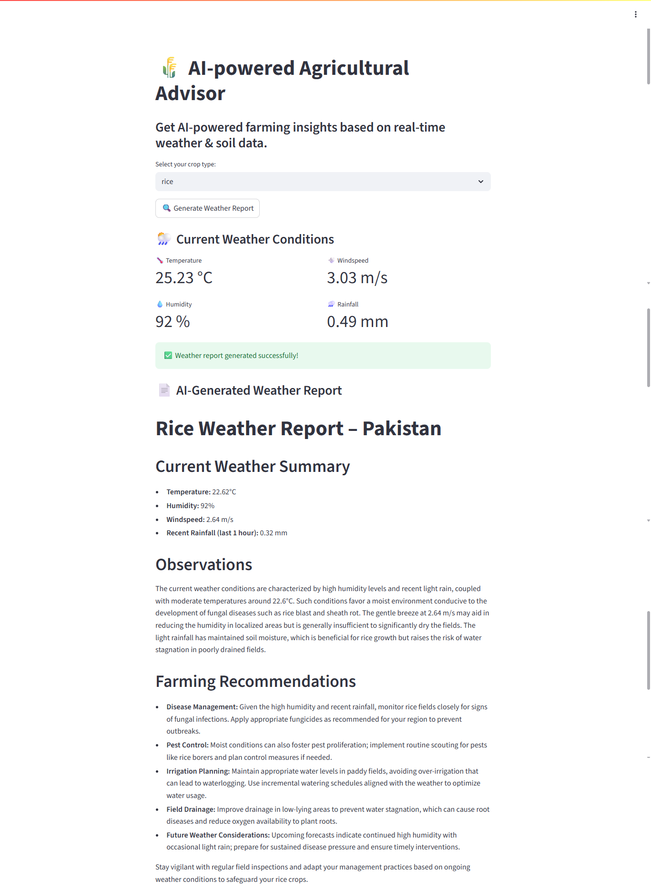

# 🌱 AI Agricultural Advisor

A CrewAI-driven pipeline that fetches live weather data, processes soil metrics, trains/evaluates a RandomForest crop recommendation model, and delivers real‑time planting & care guidance via an interactive Streamlit UI.

---

## 📖 Table of Contents

1. [Overview](#-overview)  
2. [Features](#-features)  
3. [Architecture](#-architecture)  
4. [Tech Stack](#-tech-stack)  
5. [Installation](#-installation)  
6. [Usage](#-usage)  
7. [Screenshots & Visuals](#-screenshots--visuals)  
8. [Contributing](#-contributing)  
9. [License](#-license)  
10. [Contact](#-contact)  

---

## 💡 Overview

This project enables farmers, students, and ag‑tech developers to:
- **Ingest** live weather (temp, humidity, pressure, wind, rainfall) via OpenWeatherMap  
- **Load & preprocess** soil features (N, P, K, pH, recent rainfall) from the Kaggle Crop Recommendation dataset  
- **Train & evaluate** a RandomForestClassifier (99.5% test accuracy) for recommending the ideal crop  
- **Orchestrate** data ingestion, model inference, and LLM‑driven advice with CrewAI  
- **Deliver** personalized planting and care advice in a conversational Streamlit interface  

---

## ⚙️ Features

- **Real‑time Weather**: Pulls current conditions via API  
- **Soil Data Processing**: Normalizes and feature‑engineers soil stats  
- **Crop Recommendation**: High‑accuracy RandomForest pipeline  
- **AI Advice**: GPT‑4‑powered care tips tuned to your crop & conditions  
- **CrewAI Orchestration**: Modular tasks for weather, soil, model, advice  
- **Streamlit UI**: Interactive chat‑style dashboard for actionable insights  

---

## 🏗 Architecture

  
*End‑to‑end flow: weather & soil → preprocessing → model → LLM advice → UI* 

---

## 🏗 Screenshots & Visuals

  
*Figure: Streamlit Dashboard*}  

---

## 🛠 Tech Stack

| Layer                    | Tools & Libraries                             |
|--------------------------|-----------------------------------------------|
| **Data Ingestion**       | `requests`, OpenWeatherMap API                |
| **Preprocessing**        | Python, `pandas`, `numpy`                     |
| **Feature Engineering**  | `pandas`                                     |
| **Modeling**             | `scikit-learn` (RandomForestClassifier), `joblib` |
| **LLM & Prompting**      | OpenAI GPT-4, `python-dotenv`                 |
| **Orchestration**        | CrewAI (v0.x with `@crew.task`)               |
| **UI**                   | Streamlit                                     |
| **Deployment**           | Docker, AWS ECS (or GCP Cloud Run), GitHub Actions CI/CD |

---

## 🚀 Installation

1. **Clone the repo**  
   ```bash
   git clone https://github.com/<your-username>/agri-advisor.git
   cd agri-advisor


